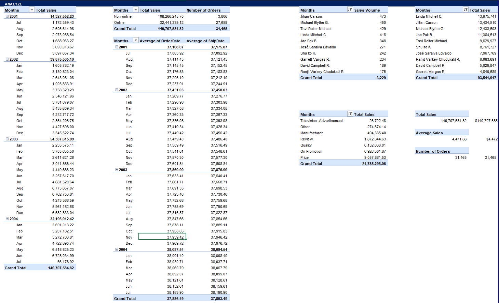
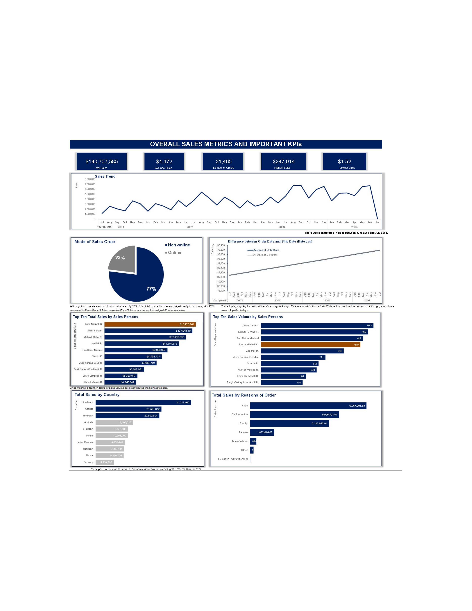

# Sales Data Analysis and Dashboard for AdventureWorks

This project involves a detailed analysis of sales data for AdventureWorks, with the creation of a comprehensive dashboard to visualize key metrics and insights. The analysis follows the six-step data analytics process: Ask, Prepare, Process, Analyze, Share, and Act.

## Table of Contents
1. [Project Overview](#project-overview)
2. [Problem Statement](#problem-statement)
3. [Skills Demonstrated](#skills-demonstrated)
4. [Data Sourcing](#data-sourcing)
5. [ETL Process](#etl-process)
    - [Prepare](#prepare)
    - [Process](#process)
6. [Analysis & Visualizations](#analysis--visualizations)
7. [Key Insights & Recommendations](#key-insights--recommendations)
8. [Conclusion](#conclusion)

## Project Overview

This project aimed to analyze and visualize key sales metrics to provide actionable insights for AdventureWorks. A dashboard was created using Excel to communicate findings effectively, focusing on improving sales performance, identifying trends, and understanding key performance indicators (KPIs).

**Key Metrics Visualized:**
- Total Sales
- Average Sales
- Sales Trends
- Sales by Salesperson, Country, and Reason
- Shipping Date Lag
- Mode of Sales Orders (Online vs. Non-online)

## Problem Statement

The main challenge addressed by this project was understanding AdventureWorks' sales performance across different regions and sales channels, identifying key sales drivers, and providing actionable recommendations to improve efficiency and customer satisfaction.

## Skills Demonstrated

- Data Cleaning and Transformation using Excel
- Data Visualization and Dashboard Creation
- Exploratory Data Analysis (EDA)
- KPI Development and Performance Monitoring
- Analytical Reasoning and Insights Generation

## Data Sourcing

The data used for this project was sourced from AdventureWorks' sales department. It contained information on sales orders, customer information, salespersons, order dates, shipping dates, and reasons for orders.

## ETL Process

### Prepare
The data was structured but required cleaning to remove redundancies, handle missing values, and standardize date formats. Various sales-related fields were extracted, transformed, and loaded (ETL) for better usability.

### Process
1. **Data Cleaning:** Removed inconsistencies, outliers, and missing data.
2. **Data Transformation:** Performed necessary transformations such as creating new columns for total sales and calculating time differences between order and shipping dates.
3. **Data Aggregation:** Grouped data by salespersons, countries, and reasons for more targeted analysis.

## Analysis & Visualizations

The dashboard was created with the following visuals:

- **Total Sales Metrics and KPIs**: Visualized key sales figures such as total sales ($140,707,585), average sales per order ($4,472), and total number of orders (31,465).
- **Sales Trend Analysis**: Showed trends in sales volume over time with a notable drop in sales between June 2004 and July 2004.
- **Mode of Sales Orders**: Displayed the split between online and non-online orders, with 12% of total orders from online, contributing 77% to total sales.
- **Shipping Date Lag**: Analyzed the average shipping lag, revealing that most items were shipped within 7-8 days.
- **Top Sales Persons and Countries**: Ranked salespersons and countries based on total sales and sales volume.

## Key Insights & Recommendations

**1. Focus on Online Sales:**
   - Although only 12% of orders were made online, they contributed significantly to sales. More resources should be allocated to growing online sales.

**2. Improve Shipping Lag:**
   - The average lag between order and shipping is 7 days. Reducing this could enhance customer satisfaction and result in fewer negative reviews.

**3. Salesperson Motivation:**
   - Linda Mitchell generated the highest sales volume but ranked lower in total sales. More focus should be placed on motivating underperforming salespersons to improve overall results.

**4. Regional Sales Focus:**
   - Sales from Southwest and Canada dominated, while European countries underperformed. A targeted strategy should be developed to boost sales in underperforming regions.

**5. Advertising Strategy:**
   - Television advertising proved ineffective. Shifting focus to more impactful methods such as promotions, price strategies, and product quality improvements is recommended.

## Conclusion

This project successfully identified areas where AdventureWorks can improve its sales strategy. By focusing on high-yield sales channels, addressing shipping delays, and optimizing salesperson performance, the company can significantly improve its overall sales and customer satisfaction.

**Link to Dashboard File:** [AdventureWorks Sales Dashboard](https://docs.google.com/spreadsheets/d/1-k_coqd1VOHj01r_ynAOudGOf-N_uMHK/edit?usp=sharing&ouid=102304971217650512121&rtpof=true&sd=true)
